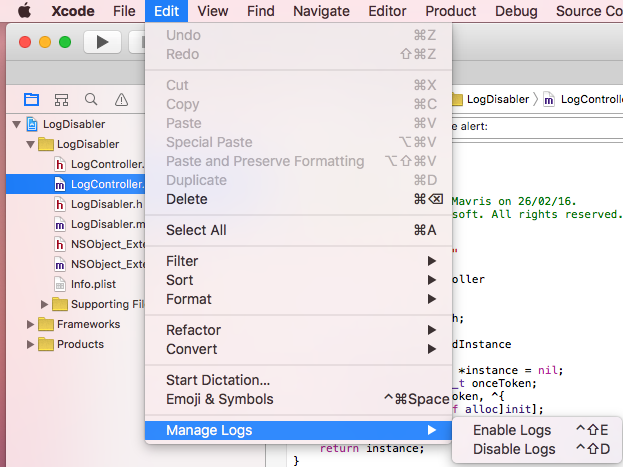

LogDisabler
======

LogDisabler is an Xcode's plug in that enables and disables all your console messages (NSLog,print).
If you are like me, then you use NSLog to print messages in console in order to check or debug your app.
Before uploading to the App Store that messages to the console have to be disabled because they might expose critical data (API urls, tokens, user's data).

### Screenshot

###Features
+ Supports Objective-C
+ Supports Swift
+ Enable all log messages
+ Disable all log messages

###Installation
- Through [Alcatraz](https://github.com/alcatraz/Alcatraz)
- Download, build the project and restart Xcode

###How to use it
- Go to Edit-> Manage Logs and choose "Enable Logs" or "Disable Logs"
- Using shortcuts CTRL+SHIFT+E to enable logs or CTRL+SHIFT+D to disable logs
- Please make sure that you saved your project before executing a command because Xcode will ask you if you want to revert or keep the original file since it's changed from other app and not Xcode.

###Unistall
- Delete the LogDisabler.xcplugin in `~/Library/Application Support/Developer/Shared/Xcode/Plug-ins/`
- Unistall from Alcatraz
- Run this command in your terminal `rm -rf ~/Library/Application\ Support/Developer/Shared/Xcode/Plug-ins/LogDisabler.xcplugin`

###How it works
LogDisabler is searching throughout the project directory (only files with .m and .swift extensions) and is replacing all `NSLog(` or `print(` strings with comments and a flag string which will be used later to enable the log messages.
Any hidden subdirectory and .git are excluded.

###Known issues
- LogDisabler will replace any `NSLog(` and `print(` strings. So if you have any `NSString` with substring `NSLog(` or `print(` it will be replaced.
- If your `NSLog` or `print` is more than one line (with return character between) then the LogDisabler will comment out only the first line and not the others. Or if you have other code in the same line after `NSLog` or `print` it will affected.

###Technical Stuff
LogDisabler is using UNIX's utility `sed`.

###USE IT AT YOUR OWN RISK
Since LogDisabler is messing with your project files it could some how break something. I am using it for my projects and it works fine but please make sure that you perfomed a commit before executing.

###Authors
* Michael Mavris

###License

Copyright Miksoft 2016

Licensed under the MIT License
